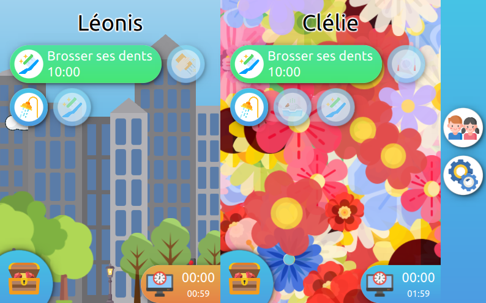

# family-assistant
An application to help organize your family life by gamifying the kids tasks. Tasks are spawn every day based on a config file, and have to be done at a certain time. By doing so, the kid earns points, that they can spend to buy decorative elements (background, fonts, icons) or special rewards (specific food, right to do something unusual).

It can also manage the weekly screen time with a timer. The kid is allowed an amount of time per week, and of course they can buy more if they have enough points.

Some critical screens are locked behind a fingerprint sensor. For the parents, this allows changing the tasks assignments, or to trigger a casual task.

The UI is designed to be very easy to understand and to use, and also error-proof (as much as that is possible :).

